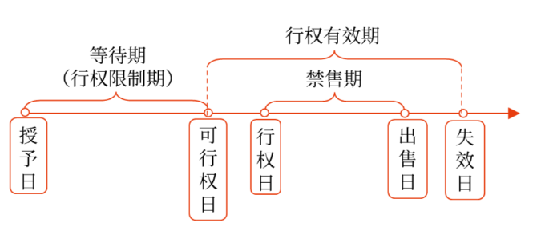
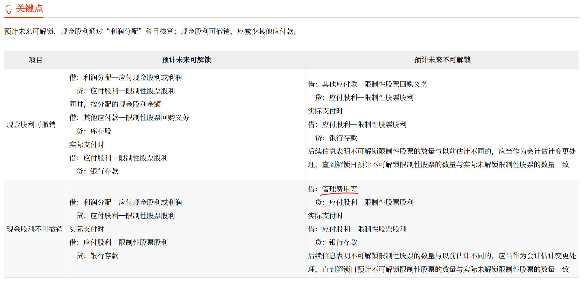
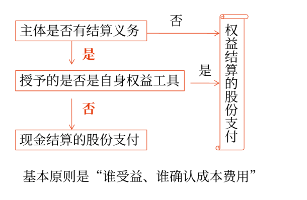

# 股份支付概述   
股份支付，是指企业为获取职工和其他方提供服务而**授予权益工具**或者承担以权益工具为基础确定的负债的交易。    
特征：
- 是企业与职工或其他方之间发生的交易；
- 是以获取职工或其他方服务为目的的交易；
- 交易的对价或其定价与企业自身权益工具**未来的价值**密切相关。  

企业自身权益工具包括会计主体本身、母公司和同一集团内的其他会计主体的权益工具。  

## 四个主要环节

  

授予日：股份支付协议[获得批准](## '需要具体到某个人多少')的日期  
可行权日：可行权条件得到满足，职工等具有从企业取得权益工具或现金权力的日期  
出售日：股票持有人将行使期权所取得的期权股票出售的日期。

## 股份支付工具的主要类型  
股份支付分为[**以权益结算的股份支付**](## '企业为获取服务而以股份（如限制性股票）或其他权益工具（如股票期权）作为对价进行结算的交易。')和[**以现金结算的股份支付**](## '企业为获取服务而承担的以股份或其他权益工具为基础计算的交付现金或其他资产义务的交易。如模拟股票和现金股票增值权。')。  

# 股份支付的确认和计量  

## 确认和计量的原则  
### 权益结算的股份支付  
- 换取职工服务的  
**价格**：应按**授予日**权益工具的公允价值计量，不确认其后续公允价值变动。  
比如，授予日股价10，行权价4，那么权益工具的公允价值就是6，计入成本费用。即使行权日股价20，也不把16当作权益工具的公允。  
**数量**：企业应在等待期内的每个资产负债表日，以**对可行权权益工具数量的最佳估计数**为基础，按照权益工具在授予日的公允价值，将当期取得的服务计入相关资产成本或当期费用，同时计入资本公积中的[其他资本公积](## '对于授予后立即可行权的，计入资本公积中的股本溢价。')。

- 换取其他方服务的   
企业应当以股份支付所换取的**服务的公允价值**计量。如果其他方服务的公允价值不能可靠计量，企业应当按照权益工具在**服务取得日**的公允价值，将取得的服务计入相关资产成本或费用。

- 权益工具公允价值无法可靠确定时的处理  
企业应当在获取对方提供服务的时点、后续的每个资产负债表日和结算日，以[内在价值](## '股票公允价值-行权价')计量该权益工具，内在价值的变动计入当期损益。同时，企业应当以最终可行权或实际行权的权益工具数量为基础，确认取得服务的金额。  
企业对上述以内在价值计量的已授予权益工具进行结算，应当遵循以下要求：
    - 结算发生在等待期内的，企业应当将结算作为加速可行权处理，即立即确认本应于剩余等待期内确认的服务金额。
    - 结算时支付的款项应当作为回购该权益工具处理，即减少所有者权益。结算支付的款项高于该权益工具在回购日内在价值的部分，计入当期损益。

### 现金结算的股份支付  
- 企业应当在**等待期的每个资产负债表日**，以对可行权情况的最佳估计为基础，按照企业承担负债的公允价值，将当期取得的服务计入相关资产成本或当期费用，同时计入负债，并在结算前的每个资产负债表日和结算日对负债的公允价值重新计量，将其变动**计入损益**。  

- 对于授予后立即可行权的现金结算的股份支付，企业应当在授予日按照企业承担负债的公允价值计入相关资产成本或费用，同时计入负债，并在[结算前](## '可行权日到行权日之间，股价还有可能变动')的每个资产负债表日和结算日对负债的公允价值重新计量，将其变动计入损益。

## 可行权条件的种类、处理和修改    

**种类**：服务期限条件、业绩条件。业绩条件包括[市场条件](## '比如股价')和[非市场条件](## '比如收益率')。

**案例 1**：20×7年1月，A公司规定如果管理层成员在其后3年中都在公司中任职服务，并且公司股价每年均提高10%以上，管理层成员即可以低于市价的价格购买一定数量的本公司股票。    
同时作为协议的补充，公司把全体管理层成员的年薪提高了50 000元，但公司将这部分年薪按月存入公司专门建立的内部基金，3年后，管理层成员可用属于其个人的部分抵减未来行权时支付的购买股票款项。如果管理层成员决定退出这项基金，可随时全额提取。   
A公司以期权定价模型估计授予的此项期权在授予日的公允价值为6 000 000元。在授予日，A公司估计3年内管理层离职的比例为每年10%；第二年年末，A公司调整其估计离职率为5%；到第三年年末，公司实际离职率为6%。  
在第一年中，公司股价提高了10.5%，第二年提高了11%，第三年提高了6%。  

    分析：如果不同时满足服务3年和公司股价年增长10%以上的要求，管理层成员就无权行使其股票期权，因此两者都属于可行权条件，其中服务满3年是一项服务期限条件，10%的股价增长要求是一项市场业绩条件。虽然公司要求管理层成员将部分薪金存入统一账户保管，但不影响其可行权，因此统一账户条款是非可行权条件。  
    第一年末确认的服务费用=6 000 000×1/3×90%=1 800 000（元）  
    第二年年末累计确认的服务费用=6 000 000×2/3×95%=3 800 000（元）  
    第三年年末累计应确认的服务费用=6 000 000×94%=5 640 000（元）  

    由此，第二年应确认的费用为：3 800 000-1 800 000=2 000 000（元）  
    第三年应确认的费用为：5 640 000-3 800 000=1 840 000（元）  

    最后，94%的管理层成员满足了市场条件之外的全部可行权条件。尽管股价年增长10%以上的市场条件未得到满足，A公司在3年的年末也均确认了收到的管理层提供的服务，并相应确认了费用。（最后这些费用应该转到哪里？）

**案例 2**：IPO  

    约定员工须服务至企业成功完成首次公开募股，否则其持有的股份将以原认购价回售给企业或其实际控制人。  
    该约定表明员工须完成规定的服务期限方可从股权激励计划中获益，属于可行权条件中的服务期限条件，而企业成功完成首次公开募股属于可行权条件中业绩条件的非市场条件，企业应当合理估计未来成功完成首次公开募股的可能性及完成时点，将授予日至该时点的期间作为等待期。  
    企业应在等待期内每个资产负债表日对预计可行权数量作出估计，确认相应的股权激励费用，等待期内企业估计其成功完成首次公开募股的时点发生变化的。应当根据重估时点确定等待期，截至当期累计应确认的股权激励费用扣减前期累计已确认金额。作为当期应确认的股权激励费用。

### 股份支付条件的修改  
**有利修改**  
- 如果修改增加了所授予的权益工具的公允价值或数量，企业应相应地确认取得服务的增加。
- 如果企业按照有利于职工的方式修改可行权条件，如缩短等待期、变更或取消业绩条件（非市场条件），企业在处理可行权条件时，应当考虑修改后的可行权条件。

**不利修改**  
如同该变更从未发生，除非企业取消了部分或全部已授予的权益工具。
- 如果修改减少了授予的权益工具的公允价值，企业应当继续以权益工具在授予日的公允价值为基础，确认取得服务的金额，而**不应考虑权益工具公允价值的减少**。
- 如果修改减少了授予的权益工具的数量，企业应当将减少部分作为已授予的权益工具的**取消**来进行处理。
- 如果企业以不利于职工的方式修改了可行权条件，如延长等待期、增加或变更业绩条件（非市场条件），企业在处理可行权条件时，**不应考虑修改后的可行权条件**。

**取消或结算**
如果企业在等待期内取消了所授予的权益工具或结算了所授予的权益工具（因未满足可行权条件而被取消的除外），企业应当：
- 将取消或结算作为加速可行权处理，**立即确认**原本应在剩余等待期内确认的金额。
- 在取消或结算时支付给职工的所有款项均应作为权益的回购处理，回购支付的金额高于该权益工具在回购日公允价值的部分，计入当期费用。
- 如果向职工授予新的权益工具，并在新权益工具授予日认定所授予的新权益工具是用于替代被取消的权益工具的，企业应以与处理原权益工具条款和条件修改相同的方式，对所授予的替代权益工具进行处理。

## 权益工具公允价值的确定  

### 股份
对于授予职工的股份，企业应按照其股份的市场价格计量。如果其股份未公开交易，则应考虑其条款和条件估计其市场价格。例如，如果股份支付协议规定了期权股票的禁售期，则会对可行权日后市场参与者愿意为该股票支付的价格产生影响，并进而影响该股票期权的公允价值。
### 股票期权
应通过期权定价模型来估计所授予的期权的公允价值，至少应考虑以下因素：  
- 期权的行权价格;  
- 期权期限;
- 基础股份的现行价格;
- 股价的预计波动率;
- 股份的预计股利;
- 期权期限内的无风险利率。

## 股份支付的处理   

### 授予日
除了立即可行权的股份支付外，企业在授予日不作会计处理。  

### 等待期内每个资产负债表日
企业应当在等待期内的每个资产负债表日，将取得职工或其他方提供的服务计入成本费用，同时确认**所有者权益或负债**。

- **权益结算**的股份支付  
应当按照**授予日权益工具的公允价值**计入成本费用和资本公积（其他资本公积），不确认其后续公允价值变动。  
借：管理费用等   
　贷：资本公积——其他资本公积     

- 现金结算的股份支付  
应当按照每个资产负债表日权益工具的公允价值重新计量，确定成本费用和应付职工薪酬。  
借：管理费用等   
　贷：应付职工薪酬    

### 可行权日之后
- 权益结算的股份支付  
在可行权日之后不再对已确认的成本费用和所有者权益总额进行调整。    

- 现金结算的股份支付  
从可行权日到真正付款给员工，中间是有时间差的。企业在可行权日之后不再确认成本费用，负债（应付职工薪酬）公允价值的变动应当计入当期损益（公允价值变动损益）。  
借：公允价值变动损益  
　贷：应付职工薪酬  
或作相反会计分录。  

### 回购股份进行职工期权激励  

1. 回购股份  
借：[库存股](## '库存股是所有者权益，不是资产。')  
　贷：银行存款（实际支付的款项）  

2. 确认成本费用  
借：管理费用等  
　贷：资本公积——其他资本公积  

3. 职工行权   
借：银行存款（企业收到的股票价款）   
　　资本公积——其他资本公积（等待期内资本公积累计 确认的金额）   
　贷：库存股（交付给职工的库存股成本）   
　　　资本公积——股本溢价（差额）     
  

### 限制性股票的会计处理

上市公司以非公开发行的方式向激励对象授予一定数量的公司股票，并规定锁定期和解锁期，在锁定期和解锁期内，不得上市流通及转让。达到解锁条件，可以解锁；如果全部或部分股票未被解锁而失效或作废，通常由上市公司按照事先约定的价格立即进行回购。  

- 授予日的会计处理   
    - 收到认股款    
    借：银行存款（企业有关限制性股票按规定履行了增资手续）  
    　贷：股本  
    　　　资本公积——股本溢价  

    - 就回购义务确认负债   
    借：库存股（按照发行限制性股票的数量以及相应的回购价格计算确定的金额）   
    　贷：其他应付款——限制性股票回购义务   

- 等待期内的会计处理
    - 与股份支付有关的会计处理  
    按权益结算股份支付确认与计量原则处理。  
    $ \triangle $
    在等待期内的每个资产负债表日，后续信息表明可解锁限制性股票的数量与以前估计不同的，应当进行调整，并在解锁日调整至实际可解锁的限制性股票数量；    
    $ \triangle $ 
    限制性股票分批解锁的，实际上相当于授予了若干个子计划，应当分别根据各子计划的可解锁数量的最佳估计在相应的等待期内确认与股份支付有关的成本费用。  

    - 分配现金股利的会计处理  
    现金股利可撤销与不可撤销的区别主要在于：不满足解锁条件的情况下，被回购限制性股票持有者是否有权享有其在等待期内应收或已收的现金股利，有权享有现金股利的，为现金股利不可撤销的限制性股票，否则为现金股利可撤销的限制性股票。对于不可撤销的，企业应当以授予时的价格回购；对于可撤销的，应以授予价格减去股利回购。  
    现金股利可撤销与现金股利不可撤销的限制性股票在会计处理上有其共同点：一是都要求对未来解锁条件的满足情况进行合理估计，并且这一估计与上述进行股份支付会计处理时在等待期内每个资产负债表日对可行权权益工具数量进行的估计应当保持一致。二是对于预计未来可解锁限制性股票持有者应分配的现金股利，都视为对股东的利润分配。   
    

- 解锁日的会计处理  
    - 对未达到限制性股票解锁条件而需回购的股票     
    借：其他应付款——限制性股票回购义务（应支付的金额）    
    　贷：银行存款     

       借：股本   
    　　资本公积——股本溢价（差额）   
        　贷：库存股（按照注销的限制性股票数量相对应的库存股的账面价值）   

    - 对达到限制性股票解锁条件而无需回购的股票  
    借：其他应付款——限制性股票回购义务（按照解锁股票相对应的负债的账面价值）  
    　贷：库存股（按照解锁股票相对应的库存股的账面价值）  
     

### ***现金结算的修改为权益结算的会计处理***  

借：管理费用（差额）   
　　应付职工薪酬（修改日已确认的负债）     
　贷：资本公积（按照所授予权益工具**修改日的公允价值**计量已取得的服务）   

$ \triangle $ 如果由于修改延长或缩短了等待期（总数），企业应当按照修改后的等待期进行上述会计处理（无须考虑不利修改的有关会计处理规定）。比如原本约定4年，2年后改为权益支付，并修改为3年，则等待期应考虑为5年。之前已经确认的成本费用数字不变。

## 集团股份支付的处理   

   
$ \triangle $ 这里的主体指会计主体，即下面例子里的二级列表

### 等待期内具体账务处理
- 结算企业（母公司）以其本身权益工具结算，接受服务企业（子公司）没有结算义务
    - 结算企业  
    借：长期股权投资  
     　贷：资本公积——其他资本公积（按权益结算股份支付计量原则确认资本公积）   
    - 接受服务企业    
    借：管理费用等  
    　贷：资本公积——其他资本公积（按权益结算股份支付计量原则确认资本公积）  

- 结算企业（母公司）不是以其本身权益工具结算，接受服务企业（子公司）没有结算义务  
    - 结算企业    
    借：长期股权投资     
    　贷：应付职工薪酬（按现金结算股份支付计量原则确认应付职工薪酬）   
    - 接受服务企业   
    借：管理费用等  
    　贷：资本公积——其他资本公积（按权益结算股份支付计量原则确认资本公积）  

- 结算企业和接受服务企业均为母公司，且授予本公司职工的是其本身权益工具    
借：管理费用等  
　贷：资本公积——其他资本公积（按权益结算股份支付计量原则确认资本公积） 

- 结算企业和接受服务企业均为母公司，且不是以其本身权益工具结算  
借：管理费用等   
　贷：应付职工薪酬（按现金结算股份支付计量原则确认应付职工薪酬）  

### 特殊问题   

**母公司向子公司高管授予股份支付时，合并财务报表中少数股东损益的计算**  
母公司向子公司高管授予股份支付，在合并财务报表中计算子公司少数股东损益时，虽然子公司的股权激励全部是由母公司结算，子公司少数股东损益中应包含按照少数股东持股比例分享的子公司股权激励费用。  

**受到激励的高管在集团内调动的会计处理**  
如果受到激励的高管在集团内调动导致接受服务的企业变更，但高管人员应取得的股权激励并未发生实质性变化，则应根据受益情况，在等待期内按照合理的标准（例如按服务时间）在原接受服务的企业与新接受服务的企业间分摊该高管的股权激励费用。即谁受益、谁确认费用。   

**非控股股东授予职工公司股份的会计处理**
集团内股份支付，包括集团内任何主体的任何股东，并未限定结算的主体为控股股东，非控股股东授予职工公司的权益工具满足股份支付条件时，也应当视同集团内股份支付进行处理。

